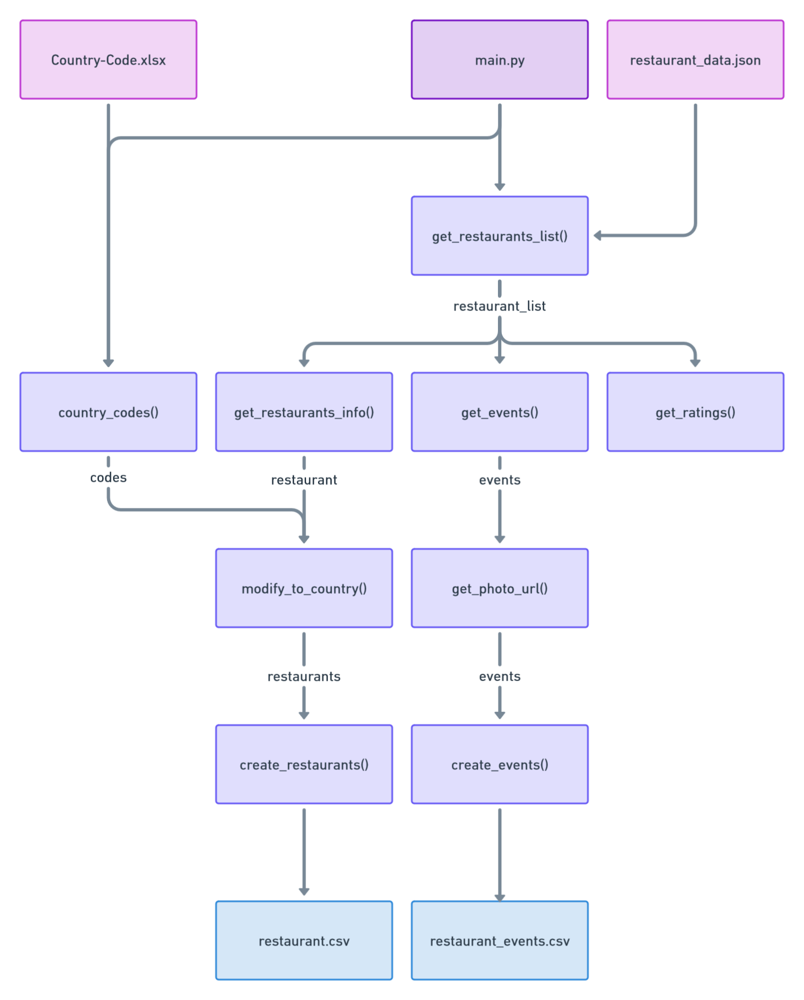

# CC4 Data Engineer Internship Tech Test
## Running the Code
Ensure the following files are in the same directory:
- `Country-Code.xlsx`
- `main.py`
- `requirements.txt`

First, using the terminal, navigate to the directory where the files are stored.

Next, run `pip install -r requirements.txt`.

Then, run `python main.py`.

## Decisions
I decided to get `restaurant_data.json` from the URL instead of downloading the file and using it locally to prevent the data from potentially being edited by users.

I used the `pandas` and `openpyxl` libraries to read `Country-Code.xlsx`. I minimised the usage of these libraries by processing the data and putting it in a dictionary instead of using Pandas' DataFrame.

I realised that there was a country code 17 that was not in `Country-Code.xlsx`. After looking through `restaurant_data.json`, I discovered that the city names for all entries with country code 17 were "Dummy". As such, I assumed that those entries were not real restaurants and thus excluded them to prevent data from being skewed.

Although Part 2 stated to "extract the list of restaurants", the list of data needed seems to imply to extract a list of events, which is what I decided to do, since it would make more sense to have one entry per event than putting the information for multiple events into one entry.

I decided to modify the event titles when populating the `restaurant_events.csv` file to ensure the entire title is within a cell by removing newline characters and commas.

I discovered that there were some restaurants with a non-English rating text. Although I could guess what the text means based on the aggregate rating and recompute the ranges for each text from it, I decided not to do it. This is because Part 3's instructions stated which rating texts to include, which I interpreted to mean that the rating texts must be exactly equivalent to one of the listed texts, rahter than the meaning of the text to be equivalent to the meaning of one of the listed texts.

I added [doctrings](https://peps.python.org/pep-0257/) to better document the code.

## Summary for Consideration of Cloud Services
To deploy the program to a cloud service, it would be ideal to first rewrite the program as a web application. This is to allow users to interact with the program easily, without requiring much technical skills. This can be done by making use of Flask within an `app.py` file. Jinja2 can be used within the HTML files to render objects on the frontend. 

Deploying a program to a cloud service implies that the program is to be scaled up. As such, the use of a database can be considered. In this case, we could use a NoSQL database such as MongoDB. This is because NoSQL offers greater scalability over relational databases since it is horizontally-scalable instead of vertically-scalable. This means that the capacity of NoSQL databases can be increased by increasing the number of servers rather than improving the random-access memory of the server. As such, the costs of scaling would be reduced. NoSQL also supports processing of unstructured data better than relational databases as not all fields in a NoSQL database has to be filled. This is particularly suited for the format of the data provided in the `restaurant_data.json` file, as some restaurants did not have events, for example. By using a database, more kinds of queries can be processed as shorter NoSQL queries can be written in place of Python functions. This also helps to reduce code redundancy.

It would also be beneficial to create a Dockerfile when deploying the program to a cloud service. This is to create a container image as containers allow for the program to be easily deployable to any cloud service, be it Amazon Web Services (AWS) or Azure. Since this program was written using Python 3.10, we could consider using the Docker image `3.10-slim-buster`. 

A possible example of how the Dockerfile could look like is as follows:
```
FROM python:3.10-slim-buster
WORKDIR /app
COPY requirements.txt requirements.txt
RUN pip install -r requirements.txt
COPY . .
CMD ["python", "-m", "flask", "run"]
```
*Adapted from [Docker Docs](https://docs.docker.com/language/python/build-images/)*

## Architecture Diagram
